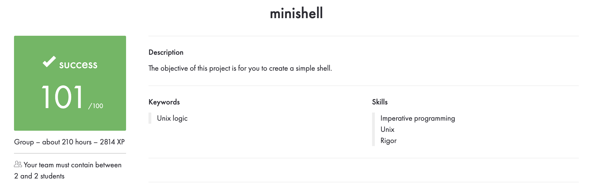

# 🐚 Minishell

> **A small shell built in C as part of the 42 School curriculum.**

Minishell recreates the core behavior of a Unix shell: it reads a command line, parses it, expands environment variables, and runs built-in or external commands. The project explores process creation, file descriptors, signals, pipes, redirections, and memory management in C.

## ✨ Features

- 🧭 Interactive command prompt powered by GNU Readline
- ⚙️ Built-in commands: `echo`, `cd`, `pwd`, `export`, `unset`, `env`, and `exit`
- 🔗 Pipelines with `|`
- 📂 Input and output redirections: `<`, `>`, and `>>`
- 📝 Here-documents with `<<`
- 🔤 Single and double quotes, with environment-variable expansion
- 🌱 Environment variable handling, including `$?` for the previous command's exit status
- 🛑 Interactive signal handling for `Ctrl-C` and `Ctrl-D`

> This is an educational shell implementation. Its behavior and edge-case coverage may differ from Bash; consult the 42 subject and try the examples below for the supported behavior.

## 🧰 Requirements

- A Unix-like environment (Linux or macOS)
- `gcc` or a compatible C compiler
- `make`
- GNU Readline development files

On Debian or Ubuntu, install Readline with:

```bash
sudo apt-get install libreadline-dev
```

On macOS with Homebrew:

```bash
brew install readline
```

If Readline is installed in a non-standard location, update the include and linker flags in the `Makefile` for your system.

## 🚀 Build and run

From the `Minishell` project directory:

```bash
make
./minishell
```

To remove generated files and rebuild:

```bash
make fclean
make
```

## 💻 Try it out

```sh
minishell$ echo "Hello from Minishell"
Hello from Minishell

minishell$ export USER_NAME=Sedef
minishell$ echo "Hello, $USER_NAME"
Hello, Sedef

minishell$ echo "first line" > output.txt
minishell$ cat < output.txt | wc -c
11
```

## 🧠 What this project demonstrates

- Parsing shell input while respecting quotes and operators
- Creating child processes and executing programs found through `PATH`
- Connecting commands through pipes and redirecting file descriptors
- Managing environment variables and command exit status
- Handling interactive signals and cleaning up allocated resources
- Organizing a multi-file C program with a Makefile and a reusable `libft`

## 📚 About the project

Minishell is a **42 School project (Rank 03)** from the Unix branch. The goal is to build a minimal shell and gain practical experience with processes, synchronization, parsing, and Unix system calls.

---

✨ *A command line of our own, built one process at a time.*


## 🏅 42 evaluation

The project received a **successful score of 101/100** as a group project. The evaluation summary is shown below.



## 👩‍💻 About

Developed collaboratively as a 42 School Unix systems project.

- GitHub: [@sakkayaa](https://github.com/sakkayaa)
- LinkedIn: [Sedef Akkaya](https://www.linkedin.com/in/sedef-akkaya-0a5580228/)
